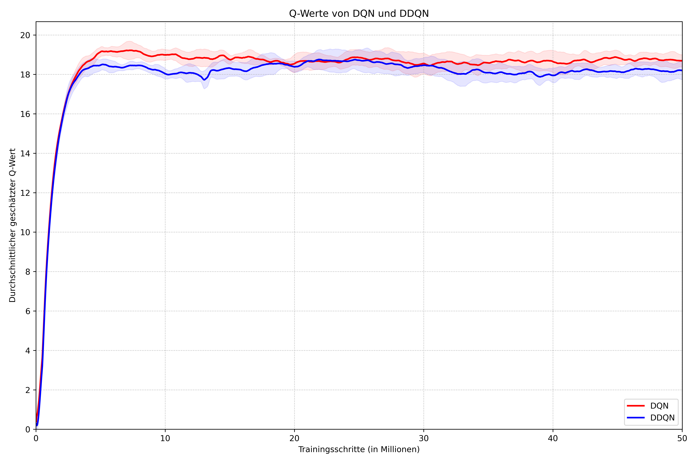

# Kompensation des Overestimation Bias: Ein Vergleich von DQN und DDQN

Dieses Repository enthält den vollständigen Quellcode und die experimentellen Daten für die Bachelor-Thesis "Kompensation des Overestimation Bias im Reinforcement Learning: Ein Vergleich von DQN und DDQN in einer Rennspielumgebung".

Das Projekt untersucht, ob der durch Double Deep Q-Networks (DDQN) eingeführte Mechanismus zur Reduzierung der Q-Wert-Überschätzung auch in einer merkmalsbasierten, deterministischen Rennspielumgebung zu einer messbar überlegenen Performanz im Vergleich zum Standard-Deep-Q-Network (DQN) führt.

## Kurze Erklärung

Das Projekt besteht aus zwei Hauptteilen:
1.  **Einer benutzerdefinierten 2D-Rennspielumgebung**, die mit Pygame entwickelt wurde. Die Umgebung liefert dem Agenten einen 18-dimensionalen Zustandsvektor, bestehend aus 16 Distanzsensoren sowie der linearen und der Winkelgeschwindigkeit des Fahrzeugs.
2.  **Einer Implementierung der DQN- und DDQN-Algorithmen** unter Verwendung von TensorFlow und Keras. Beide Agenten nutzen exakt dieselbe Netzwerkarchitektur und Hyperparameter, um einen fairen und kontrollierten Vergleich zu ermöglichen.

Alle Experimente, Konfigurationen und Ergebnisse werden automatisch im `experiments/`-Verzeichnis gespeichert.

## Installationsanleitung

Das Projekt wurde mit Python 3.x entwickelt. Um die notwendigen Pakete zu installieren, wird die Verwendung einer virtuellen Umgebung (z.B. mit `venv`) empfohlen.

### 1. Klonen des Repositories:

```bash
git clone https://github.com/Zickswag/bachelor-thesis.git
cd bachelor-thesis
````

### 2. Erstellen und Aktivieren einer virtuellen Umgebung (optional, aber empfohlen):

#### Windows:

```bash
python -m venv venv
.\venv\Scripts\activate
```

#### macOS / Linux:

```bash
python3 -m venv venv
source venv/bin/activate
```

### 3. Installation der Abhängigkeiten:

```bash
pip install tensorflow
pip install pygame
pip install numpy
```

## Training der Agenten

Das Training wird über das Hauptskript `main.py` gesteuert.

### Einfacher Start

Um ein Training mit den Standardparametern zu starten, führen Sie folgenden Befehl aus:

```bash
python main.py
```

Standardmäßig wird der DQN-Agent trainiert. Um den DDQN-Agenten zu trainieren:

```bash
python main.py --agent ddqn
```

Die Ergebnisse, Logs und Modell-Checkpoints werden automatisch in einem neuen Ordner unter `experiments/[agent-name]/[timestamp]/` gespeichert.

### Reproduktion der Thesis-Ergebnisse

Für die in der Arbeit präsentierten Ergebnisse wurde ein fester Satz von 5 Seeds verwendet, um die statistische Robustheit zu gewährleisten. Die verwendeten Seeds sind:

`[0, 1, 2, 3, 4]`

Um einen spezifischen Lauf zu reproduzieren (z.B. DQN mit Seed 3), setzen Sie die Umgebungsvariable `PYTHONHASHSEED` vor dem Start:

#### macOS / Linux:

```bash
PYTHONHASHSEED=3 python main.py --agent dqn
```

#### Windows (PowerShell):

```powershell
$env:PYTHONHASHSEED=3; python main.py --agent dqn
```

## Monitoring und Evaluation

Die Ergebnisse jedes Trainingslaufs werden auf zwei Arten protokolliert, um eine Analyse zu ermöglichen:

### 1. Live-Monitoring mit TensorBoard

Alle wichtigen Metriken werden in Echtzeit in TensorBoard-Logs geschrieben. Um den Trainingsfortschritt live zu überwachen oder nach Abschluss zu analysieren, starten Sie TensorBoard und verweisen auf das `experiments`-Verzeichnis:

```bash
tensorboard --logdir experiments
```
Öffnen Sie anschließend die in der Konsole angezeigte URL (üblicherweise `http://localhost:6006`) in Ihrem Browser. Dort können Sie die Lernkurven für verschiedene Läufe vergleichen.

### 2. Rohdaten als CSV

Für eine detaillierte statistische Analyse werden alle Metriken zusätzlich in einer `metrics.csv`-Datei innerhalb des jeweiligen Run-Verzeichnisses gespeichert. Diese Dateien bilden die Grundlage für die in der Thesis erstellten aggregierten Graphen und weiterführenden Analysen.

### 3. Ergebnisse
Die folgenden Abbildungen zeigen die aggregierten Resultate aus den Experimenten:

**Trainingsverlauf über alle Seeds** 


**Vergleich der geschätzten Q-Werte** 


---

## Optionale Parameter

Das Skript `main.py` akzeptiert folgende Kommandozeilenargumente zur Steuerung der Hyperparameter:

| Argument                 | Standardwert | Erklärung                                                          |
| ------------------------ | ------------ | ------------------------------------------------------------------ |
| `--agent`                | "dqn"        | Wählt den Agenten-Typ aus (`dqn` oder `ddqn`).                     |
| `--layers`               | 18 18 18     | Anzahl der Neuronen in den versteckten Schichten.                  |
| `--lr`                   | 0.0001       | Lernrate ($\alpha$) für den Adam-Optimizer.                        |
| `--gamma`                | 0.99         | Diskontfaktor ($\gamma$) für zukünftige Belohnungen.               |
| `--batch_size`           | 512          | Anzahl der Transitionen pro Trainings-Batch.                       |
| `--mem_size`             | 250000       | Maximale Anzahl an Transitionen im Replay Buffer.                  |
| `--exploration_steps`    | 12500        | Anzahl der zufälligen Schritte zu Beginn zum Füllen des Buffers.   |
| `--replace_target_steps` | 10000        | Häufigkeit, mit der das Target-Netzwerk aktualisiert wird.         |
| `--save_interval`        | 100          | Speichert das Modell alle X Episoden.                              |
| `--epsilon_start`        | 1.0          | Startwert für die $\epsilon$-greedy Strategie.                     |
| `--epsilon_end`          | 0.1          | Minimaler Wert für $\epsilon$.                                     |
| `--epsilon_decay_steps`  | 250000       | Anzahl der Schritte zur linearen Epsilon-Reduktion.                |
| `--render_freq`          | 0            | Renderfrequenz der Umgebung. `0` bedeutet kein Rendern.            |
| `--max_steps`            | 50000000     | Gesamtanzahl der Trainingsschritte.                                |

